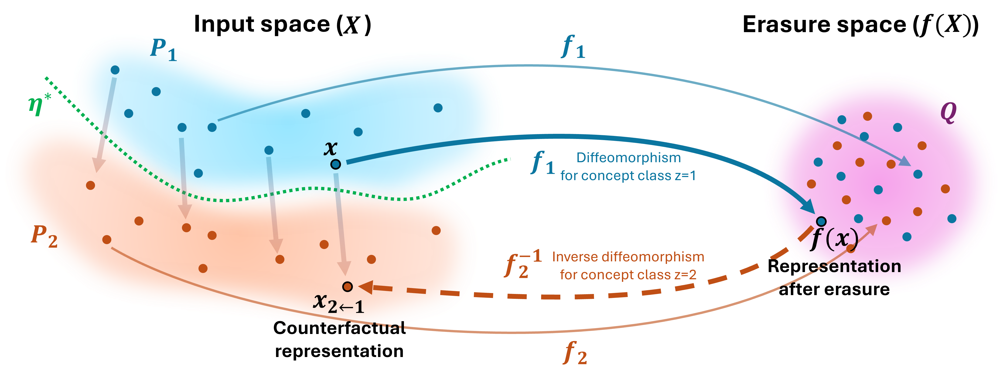
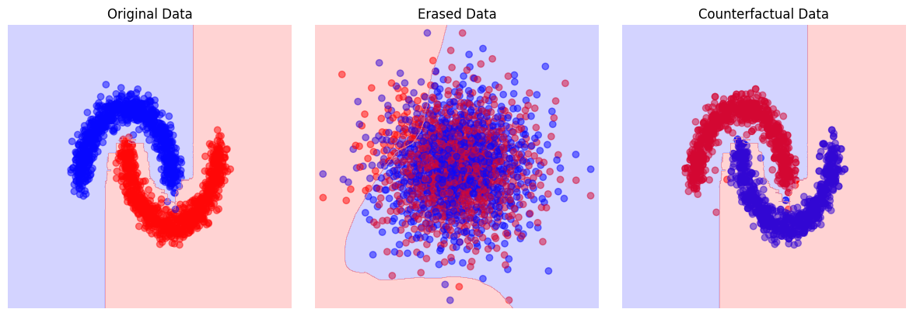

# MUtE: A Dual Framework for Concept Erasure and Counterfactual Interventions


This repository contains the code and data for the experiments included in the paper:<br/>
**Saillenfest Antoine (2026) MUtE: A Dual Framework for Concept Erasure and Counterfactual Interventions**

<p align="center">

</p>

MUtE is a framework for erasing sensitive concepts from continuous representations while inducing a deterministic counterfactual mapping, which allows for both bias mitigation and the generation of counterfactuals.

## MUtE - Maximum Utility-preserving Erasure function

The Python class MUtE implements several methods for discrete concept erasure and counterfactual representation generation. Below are code snippets demonstrating its basic usage, as seen in the quickstart notebook.


### Quickstart 

```python
import matplotlib.pyplot as plt
import numpy as np

from sklearn.datasets import make_blobs
from sklearn.model_selection import train_test_split
from sklearn.neural_network import MLPClassifier
from sklearn.metrics import accuracy_score  

from erasers import MUtE

# Create a toy dataset
x, z = make_blobs(n_samples=2000, centers=2, n_features=2, random_state=42)
x, x_test, z, z_test = train_test_split(x, z, test_size=0.2, random_state=42)

# Erasure 
erasure_model = MUtE(nsteps=50) 
x_ = erasure_model.fit_transform(x,z) # learn the erasure function (including the concept classifier for routing)
x_test_ = erasure_model.transform(x_test)

# Counterfactual generation
z_cf = 1 - z
x_cf = erasure_model.inverse_transform(x_, z_cf)

# Evaluation (probing accuracy)
clf = MLPClassifier(random_state=42, early_stopping=True).fit(x,z)
print(f"Probing accuracy before erasure: {accuracy_score(z_test, clf.predict(x_test)):.4f}")
clf_ = MLPClassifier(random_state=42, early_stopping=True).fit(x_, z)
print(f"Probing accuracy after erasure: {accuracy_score(z_test, clf_.predict(x_test_)):.4f}")
```

```console
Class predictor trained with accuracy (on train set): 0.994375
Iteration 50/50 complete.: 100%|██████████| 50/50 [00:00<00:00, 309.30it/s]
Probing accuracy before erasure: 0.9950
Probing accuracy after erasure: 0.5125
```
### Optimal erasure

To use the theoretically optimal erasure model, MUtE*, set the `optimal_erasure` parameter during initialization. In this mode, concept labels are required at inference when calling the `transform` method.

```python
erasure_model = MUtE(nsteps=50, optimal_erasure=True) # MUtE*
erasure_model.fit(x,z) # learn the erasure function 
x_ = erasure_model.transform(x, z) # the 'erasure' function depends on x and z
```

### Using an independantly trained concept predictor

By default, the model trains a scikit-learn `MLPClassifier` as the concept predictor, though this may not be optimal for all datasets. You may find it useful to train a custom concept predictor (`clf`) independently and use it to fit the MUtE erasure model. To do this, simply pass `clf` as an argument to the `fit` or `fit_transform` methods.

```python
erasure_model = MUtE(nsteps=50, optimal_erasure=False) # MUtE
erasure_model.fit(x,z, class_predictor=clf) # learn the erasure function 
x_ = erasure_model.transform(x) # the erasure function only depends on x
```
<p align="center">

</p>


A notebook demonstrating a minimal example can be found at ./notebooks/minimal.ipynb.

## Reproducing the experiments


### Setup the environment

Python version: 3.12.9

Setup an environment (we used [uv](https://docs.astral.sh/uv/getting-started/))

\# Create the environment

```shell
uv venv mute
```

\# Install the libraries
```shell
uv pip install torch torchvision torchaudio --index-url https://download.pytorch.org/whl/cu126
uv pip install scikit-learn concept_erasure pyyaml transformers tqdm ipykernel matplotlib pot
```

\# Activate the environment
```shell
source mute/bin/activate
```

### Datasets

Follow the [guidelines for downloading and preprocessing the data](./data/readme.md).


## Run the experiments

### Synthetic data

Run the notebook in ./notebooks/quickstart.ipynb

### Utility, Erasure, Fairness
To run the experiments:

1) Uncomment the configuration to use at the beginning of the script 
2) Run the script
> python -m scripts.evaluations # Erasure, Utility preservation & Fairness

> python -m scripts.evaluations_fairness # Fairness and data augmentation

The script trains a model then evaluates it.

### Counterfactual texts generation

Embed the data using
Run the notebook in ./notebooks/biasbios/gtr-base/counterfactuals.ipynb

### Surrogates

> python -m scripts.surrogates


<!-- See also the ```requirement.txt``` file. -->